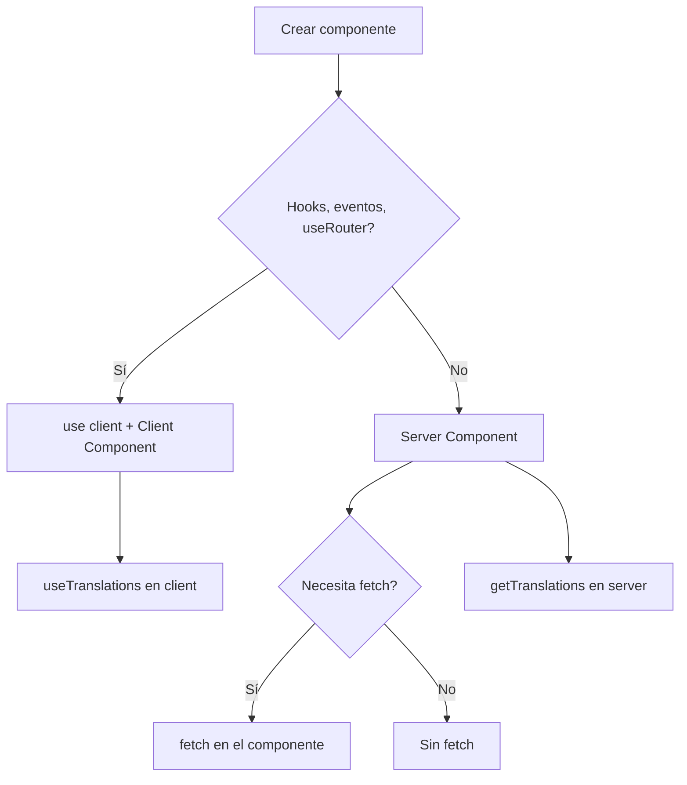

# Best Practices — Invitation Project

Referencia para agentes y desarrolladores. Fuentes: Context7 (Next.js, next-intl, Tailwind CSS), documentación oficial.

**Workflow obligatorio:** Antes de cualquier edit o plan, verificar rama (`git branch --show-current`). Si `main` o `develop`, crear rama feature desde develop. Ver [git-workflow](.cursor/rules/git-workflow.mdc).

## Tabla resumen

| Área | Práctica | Ejemplo | Regla |
|------|----------|---------|-------|
| Next.js | Server Components por defecto | Sin `"use client"` si no hay hooks/eventos | [nextjs.mdc](.cursor/rules/nextjs.mdc) |
| Next.js | `await params` | `const { locale } = await params` | [nextjs.mdc](.cursor/rules/nextjs.mdc) |
| Next.js | `setRequestLocale` en pages | `setRequestLocale(params.locale)` al inicio | [nextjs.mdc](.cursor/rules/nextjs.mdc), [i18n.mdc](.cursor/rules/i18n.mdc) |
| Next.js | Routing hooks desde `next/navigation` | `useRouter`, `usePathname`, `useSearchParams` | [nextjs.mdc](.cursor/rules/nextjs.mdc) |
| i18n | ICU para fechas | `{orderDate, date, short}` en JSON | [i18n.mdc](.cursor/rules/i18n.mdc) |
| i18n | ICU para números | `{count, number}` — nunca `"{count} followers"` | [i18n.mdc](.cursor/rules/i18n.mdc) |
| i18n | ICU para plurales | `{count, plural, =0 {...} =1 {...} other {...}}` | [i18n.mdc](.cursor/rules/i18n.mdc) |
| Responsive | Mobile-first | Base = móvil; `md:`, `lg:` sobrescriben | [responsive-design.mdc](.cursor/rules/responsive-design.mdc), [styling.mdc](.cursor/rules/styling.mdc) |
| Responsive | Breakpoints estándar | `sm` 640px, `md` 768px, `lg` 1024px, `xl` 1280px, `2xl` 1536px | [responsive-design.mdc](.cursor/rules/responsive-design.mdc) |
| Responsive | Container queries | `@container` padre, `@md:flex-row` hijos | [responsive-design.mdc](.cursor/rules/responsive-design.mdc) |
| Styling | Clases estáticas | Mapas `{ primary: "bg-indigo-500" }` — no `` `bg-${color}` `` | [styling.mdc](.cursor/rules/styling.mdc) |
| Styling | Touch-friendly | `min-h-[44px]` para botones/links | [responsive-design.mdc](.cursor/rules/responsive-design.mdc) |

## Server vs Client Component

## Checklist para componentes

- [ ] **Responsive**: mobile-first con `sm:`, `md:`, `lg:` según diseño
- [ ] **i18n**: `useTranslations`/`getTranslations` con namespace; ICU para fechas, números, plurales
- [ ] **Accesibilidad**: semantic HTML, ARIA donde aplique, soporte teclado
- [ ] **Clases estáticas**: sin interpolación dinámica; mapas de clases si hay variantes
- [ ] **Touch-friendly**: `min-h-[44px]` en elementos interactivos
- [ ] **`"use client"`**: solo si usa hooks, event handlers, `useRouter`, APIs del navegador

## Fuentes

- [Next.js Docs](https://nextjs.org/docs) — App Router, Server/Client Components
- [next-intl](https://next-intl-docs.vercel.app) — ICU message format, routing
- [Tailwind CSS](https://tailwindcss.com/docs) — Responsive design, breakpoints, container queries
